**WeQ** 是一个 NTQQ 自主的本地数据库解密、解析与导出工具。

如果你需要导出和分析**微信聊天记录**：[WeChatDataAnalysis](https://github.com/LifeArchiveProject/WeChatDataAnalysis)   是相当不错的选择

欢迎加入**QQ交流群**讨论交流： [](https://qm.qq.com/q/ysMZoAcC1a)

---

## 核心功能

- <details> <summary>数据库密钥获取</summary> 支持通过在线QQ实例，本地保存凭据，离线计算（Android）等方式获取数据库密钥<br> 期间无需重启QQ，也无需预先登录，本项目会根据QQ在线情况，<strong>动态选择方案获取密钥，用户无需任何操作</strong> </details>
- <details> <summary>离线查看和修改聊天记录</summary> 本项目基于Electron，实现了高仿QQ聊天的界面，<strong>体验原汁原味的聊天记录查看</strong> <br> 本项目支持<strong>私聊，群聊，官方账号，频道私聊等</strong>几乎所有聊天记录的解析 </details>
- <details> <summary>QQ装扮查看</summary> 仅使用电脑端的数据，即可解析出<strong>完整的消息装扮</strong> 包括气泡，字体，挂件<br> 本项目支持下载和解析装扮资源，<strong>在PC端查看和手机端同样的渲染效果</strong><br><br>本项目同时支持导出装扮资源在外部使用  </details>
- <details> <summary>聊天记录导出</summary> 支持导出聊天记录为<strong>各种格式</strong>，json txt xlsx等等等<br> 同时支持导出联系人，我的收藏，QQ空间等等等附带资源 </details>
- **年度报告**和单聊会话分析
- 好友克隆和克隆好友群聊（<del>赛博斗蛐蛐</del>）
- **消息防撤回**和删除消息查看
- 聊天分析agent和MCP

| 高仿QQ聊天页面（装扮） | **好友克隆** |
| -------------- | ---------- |
| 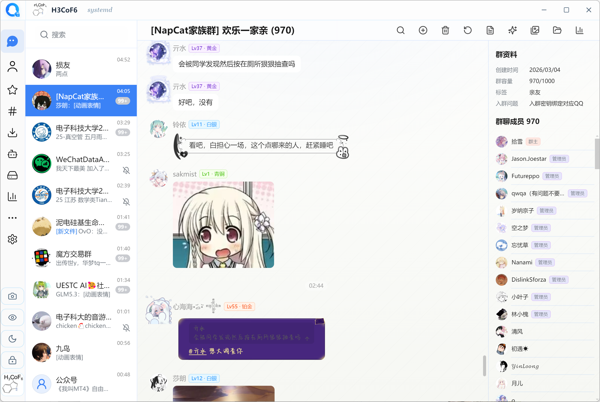 | 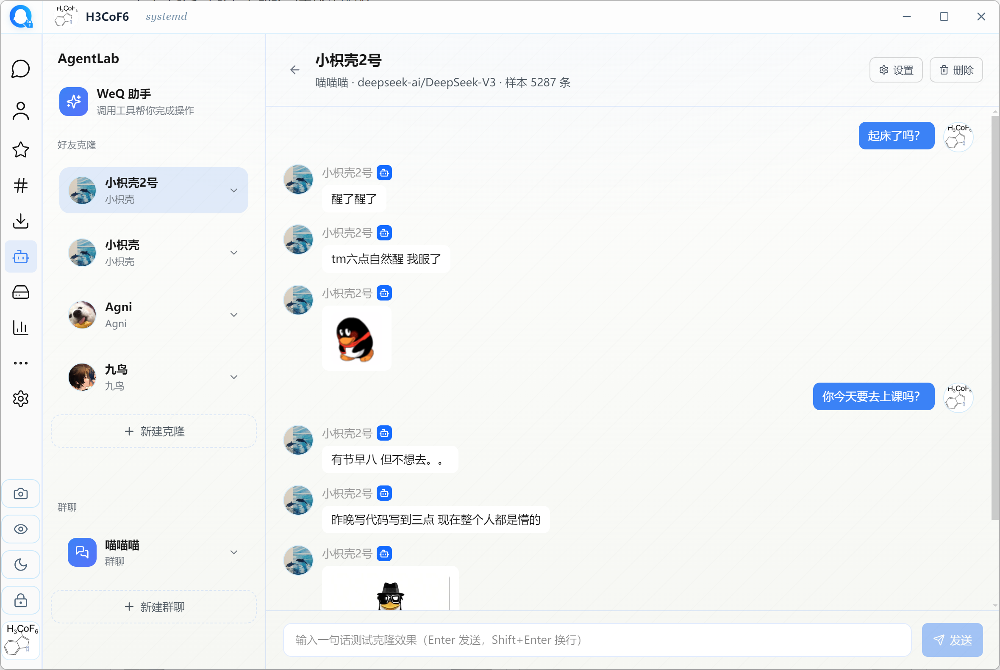 |
| **导出聊天记录** | **QQ个性装扮** |
| 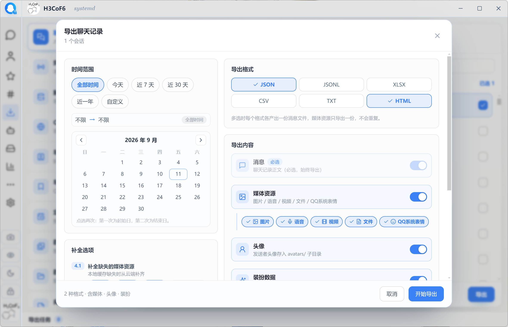 | 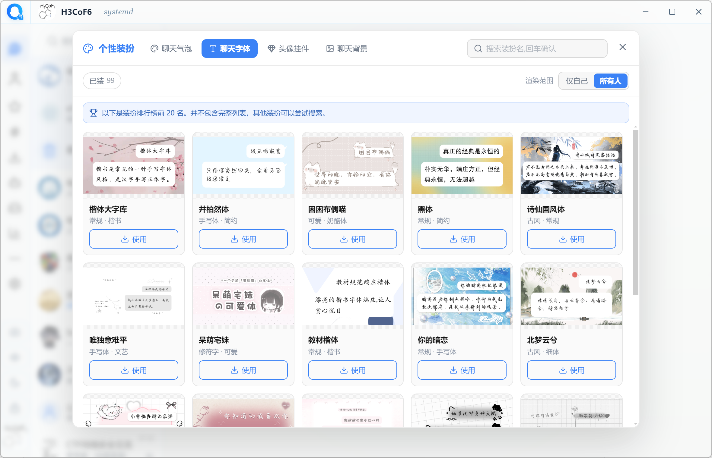 |
| **年度/历史报告**                                            | **修改/新增消息**                                            |
| 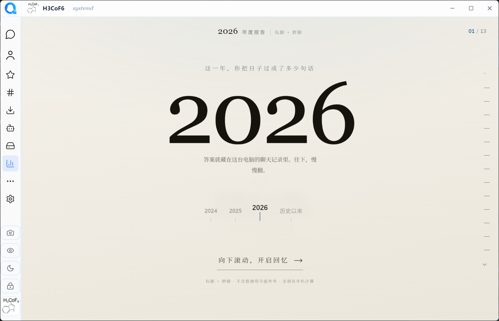 | 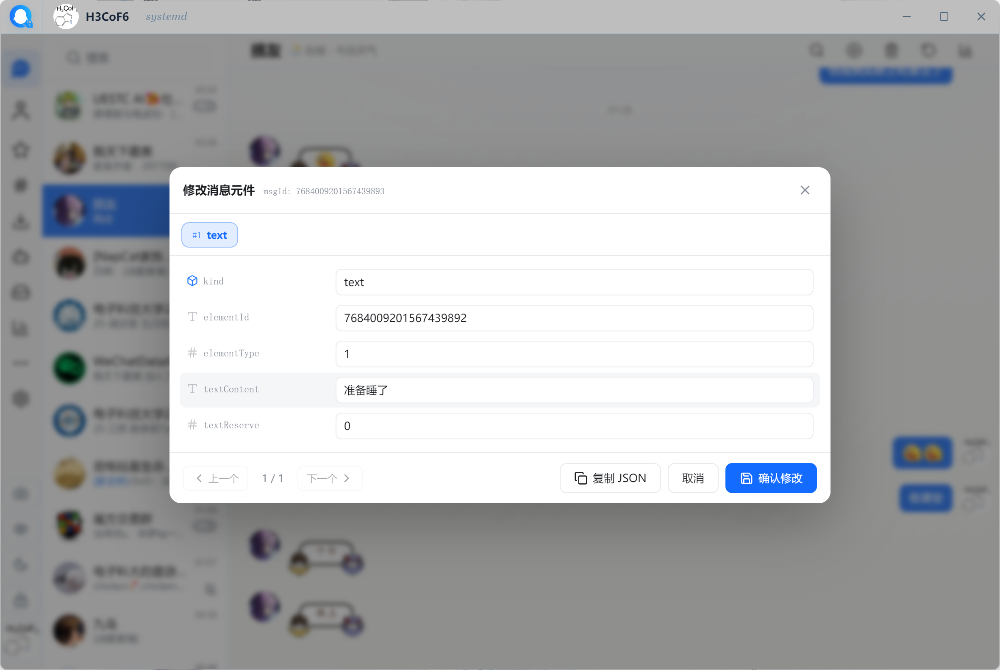 |
| **离线防撤回** | **agent助手** |
| 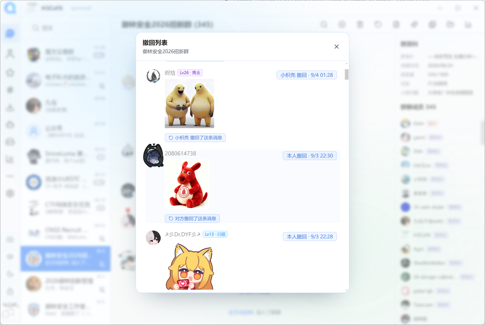 | 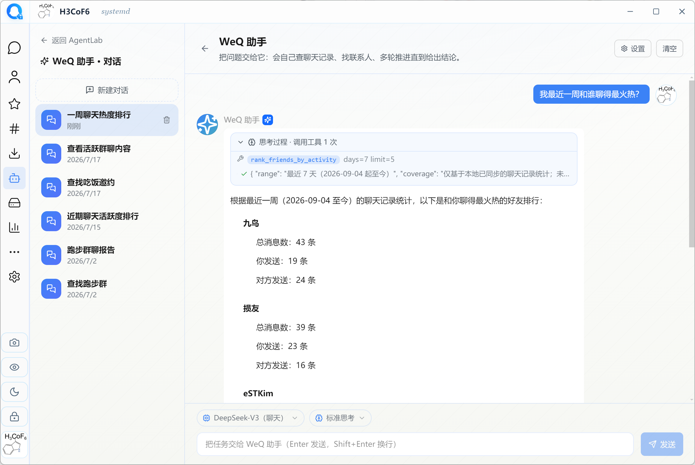 |
| **群相册查看和导出** | **QQ空间导出html** |
| 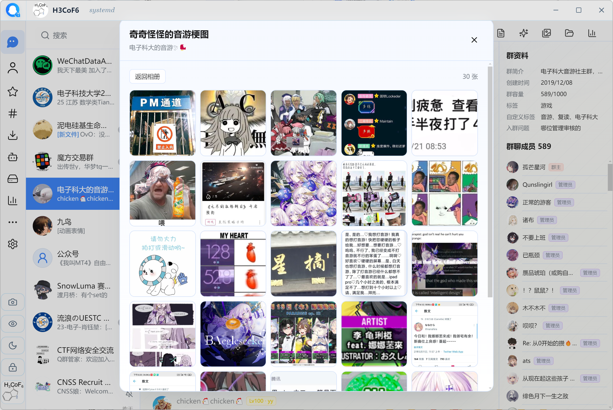 | 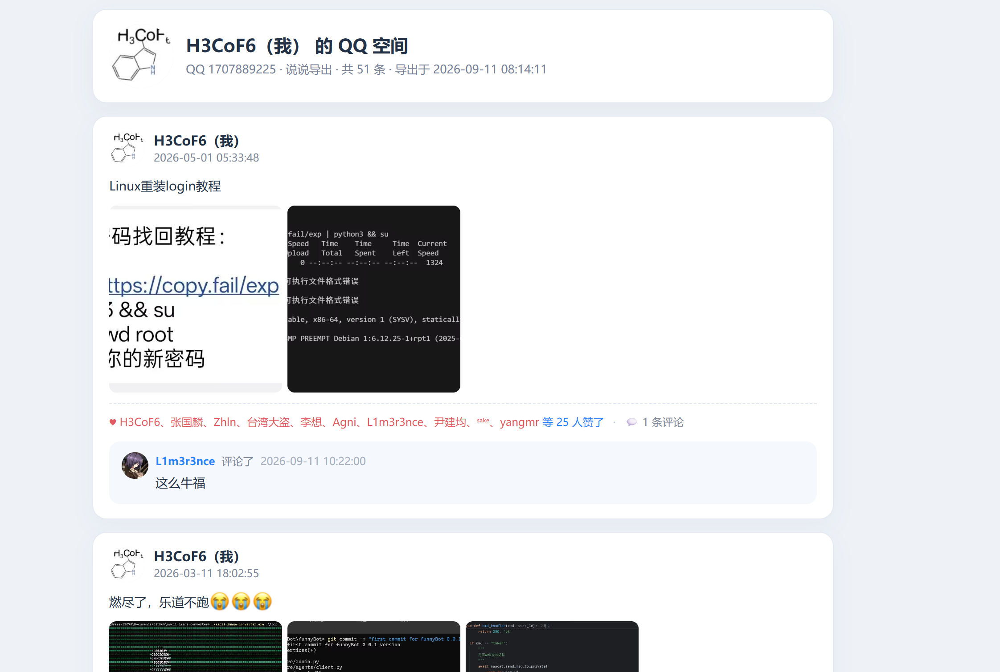 |
| **群聊/私聊分析** | **QQ缓存资源清理** |
| 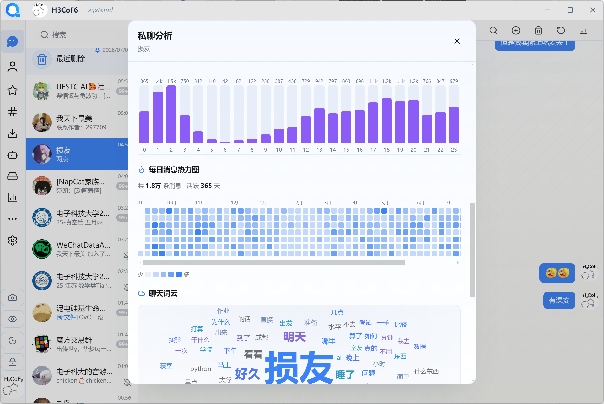 | 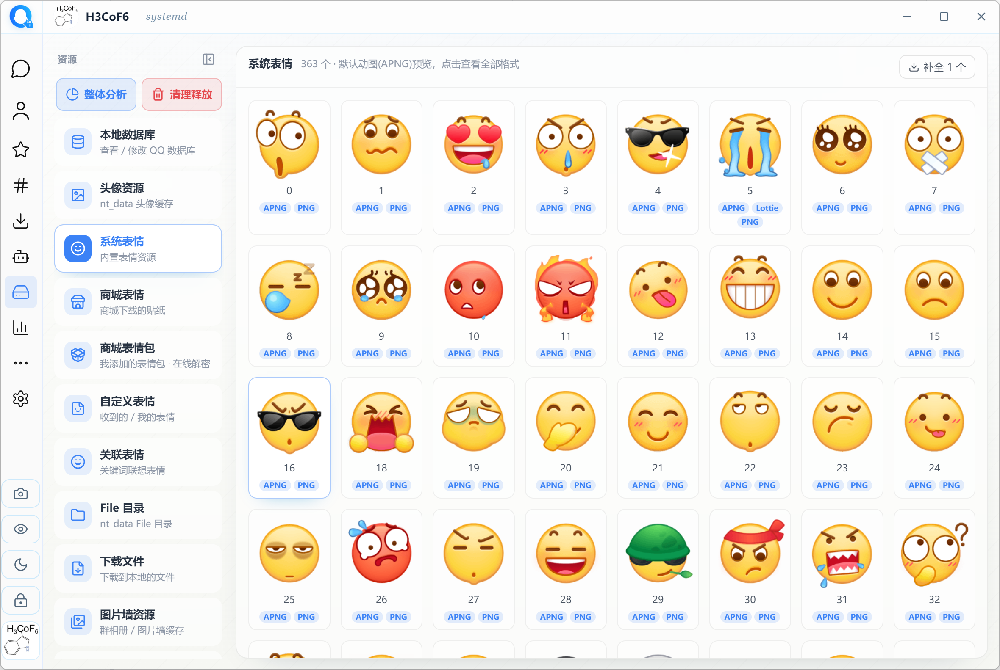 |


> 完整功能请查看[使用手册](./docs/guide/index.md)，更多内容见 [文档中心](./docs/README.md)

## 使用方法

1. 前往 [Releases](../../releases) 下载最新版本
2. 按照引导操作获取数据库密钥 
3. 打开对应账号即可开始使用

> [!tip]
>
> **支持的设备**
>
> | 系统 | Windows            | MacOS      | Linux      |
> | ---- | ------------------ | ---------- | ---------- |
> | 架构 | x64，**不支持arm** | arm，intel | x64，arm64 |

### web版

除桌面版外还提供 **WeQ Web** —— 同一套界面与功能，跑在浏览器里。适合无桌面环境的机器
（NAS / 服务器 / WSL），或想从别的设备访问。

下载 `weq-web-<版本>-<平台>.tar.gz`（每个平台一个包，**需自备 Node ≥ 22**），
解压后直接运行启动脚本即可（Windows 双击 `start.bat`，Linux/macOS 执行 `./start.sh`）：

```bash
./start.sh        # Linux / macOS
start.bat         # Windows
```

终端会打印地址和访问令牌，浏览器打开即可。默认只监听本机；
**对外暴露前请先读 [apps/web/README.md](./apps/web/README.md)**。

#### 开发者指南

开始运行：

```bash
git clone https://github.com/H3CoF6/WeQ   # 克隆仓库代码
cd WeQ

pnpm i                     # 安装依赖（electron可能需要单独处理）
pnpm run build:bot         # 构建bot代码
pnpm run build:ninebird    # 构建ninebird代码
pnpm run build:daemon      # 构建守护进程代码

pnpm dev                   # 启动开发服务器
```

打包发布：

```bash
pnpm run build                  # = build:bot + build:ninebird + 桌面版构建 + electron-builder（安装包）
pnpm --filter @weq/web build    # 浏览器版（先跑 pnpm run build:daemon 保证随包二进制齐全）
```

> 贡献代码请先阅读 [贡献指南](./CONTRIBUTING.md)  作为参考

## 致谢

| 项目                                                         |            参考            |
| ------------------------------------------------------------ | :------------------------: |
| [NapNeko ](https://github.com/NapNeko)团队                   |      **大量实现参考**      |
| [webark-im-template](https://github.com/dogxii/webark-im-template) |      QQ 聊天界面模板       |
| [QQBackup](https://github.com/QQBackup)                      | 整理保存了大量QQ数据库资料 |

**同时也感谢每一个为WeQ及相关项目做出贡献的开发者**：

<a href="https://github.com/H3CoF6/WeQ/graphs/contributors">
  
</a>

## 开源协议

本项目基于 [**CC BY-NC-SA 4.0**](./LICENSE)（知识共享 署名-非商业性使用-相同方式共享 4.0 国际）协议开源。这意味着你可以自由地使用、分享和修改本项目，但需遵守以下条款：

- **署名（BY）** —— 必须注明原作者及项目来源，并注明是否做了修改。
- **非商业性使用（NC）** —— **禁止用于任何商业用途**，包括但不限于付费贩卖、倒卖本项目或其衍生作品。
- **相同方式共享（SA）** —— 若你修改或基于本项目二次创作，衍生作品必须以**相同的 CC BY-NC-SA 4.0** 协议开源。

> 没有Star History了喵\~\~\~
