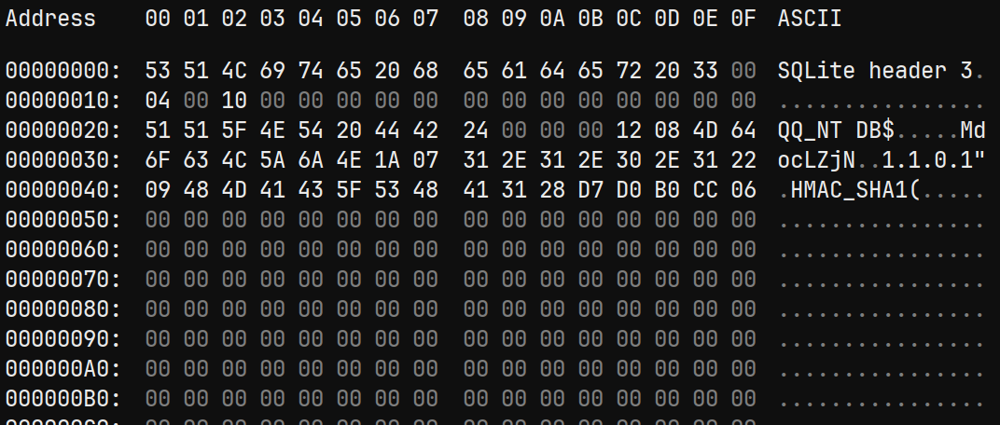
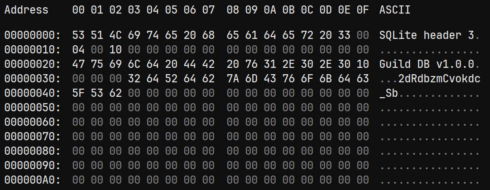
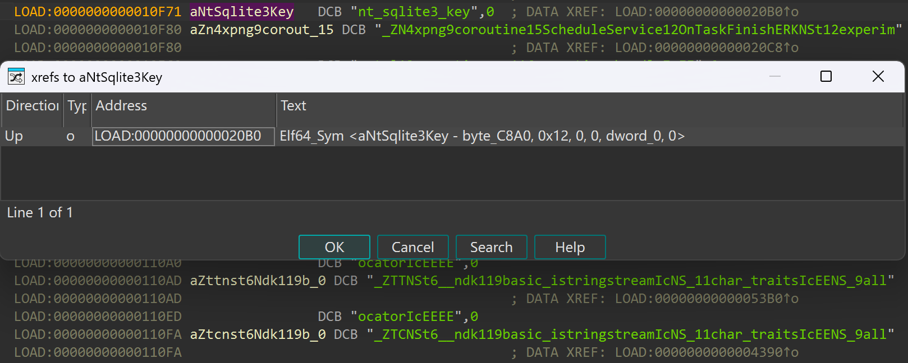
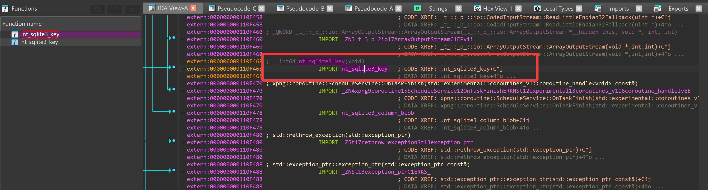
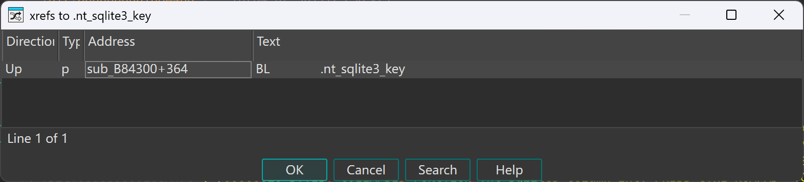
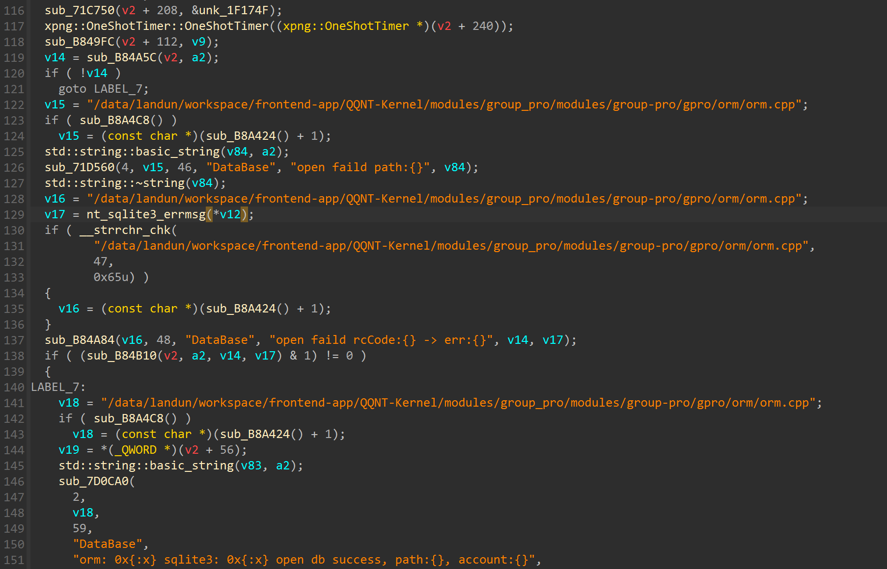
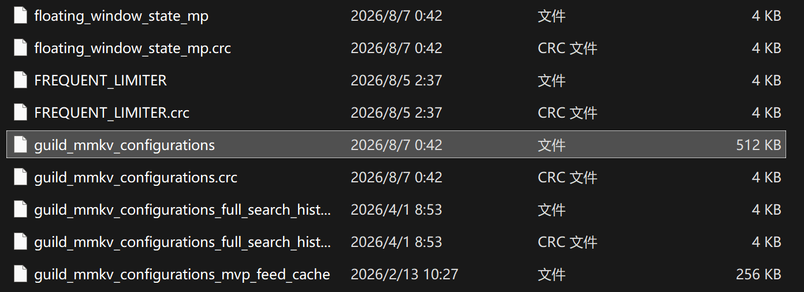
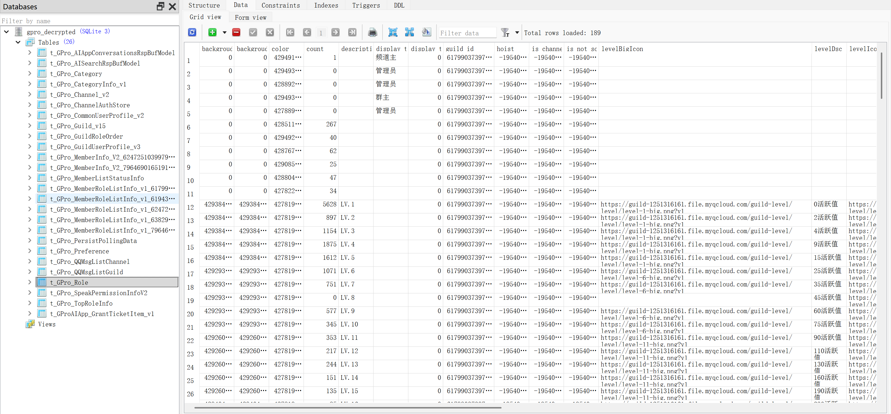

## Gpro数据库密钥计算 && 解密分析

> [!tip]
>
> 这不是教程性文章，更多的是记录逆向（<del>踩坑</del>）经过

### Gpro 数据库基础信息分析

安卓的数据库目录里面，有一类特殊的数据库，**不能按照标准的消息数据库来解密**，那实际上是**QQ频道Guild模块**的存储数据库
命名形式为：`gpro_v1-6_{uid}.db`  例如：`gpro_v1-6_u_LKt3AdAIMP-CUfn6ydzDzw.db`

我们通过它里面的`uid`，可以**直接知道本目录的所属账号**，对于android数据库，我们就可以直接计算出数据库密钥：
$$
db\_key = md5(md5(uid)+key\_meta)
$$

对比Gpro数据库和标准数据库（android）的开头：
<del>我很喜欢010editor的但是过期了，下面的截图是替代品</del>

| nt_msg.db                                                    | Gpro数据库                                                   |
| ------------------------------------------------------------ | ------------------------------------------------------------ |
|  |  |

明显可以看到，**都存在key_meta，但是长度和位置都有所区别**，正常派生会解密失败。
所以，开始逆向\~\~\~

### 第一轮静态分析`libgpro.so`

老办法去定位`nt_sqlite3_key`





一路向上追到`B84300`函数


是sqlite的初始化函数，**而密钥算法硬编码在这里面的**

```cpp
    sub_7D0CA0(
      2,
      v18,
      59,
      "DataBase",
      "orm: 0x{:x} sqlite3: 0x{:x} open db success, path:{}, account:{}",
      v2,
      v19,
      v83,
      v11);
    std::string::~string(v83);
    std::to_string(v82, v11);
    sub_B84D6C(v2);
    xpng::SHA1HashString(v81, v82);
    xpng::MD5String(v80, v82);
    xpng::MD5String(v79, v81);
    sub_8776F8((unsigned __int8 *)v80, (unsigned __int8 *)v79, &v90);
    v20 = xpng::MD5String(v78, &v90);
    v21 = sub_B8A72C(v20);
    v22 = sub_B8A9F8(v21);
    v75 = nullptr;
    v76 = 0;
    v77 = 0;
    v74 = 0;
    v73 = 0;
    sub_B84D9C(v22, v23, v24, v25);
    if ( (sub_B84B10(v2, a2, v14, "WriteExtHeader Failed") & 1) != 0 )
    {
      v26 = sub_B84D6C(v2);
      v27 = sub_B8A9F8(v26);
      v76 = v28;
      sub_B84D9C(v27, v29, v30, v31);
    }
    else
    {
      v35 = "/data/landun/workspace/frontend-app/QQNT-Kernel/modules/group_pro/modules/group-pro/gpro/orm/orm.cpp";
      if ( sub_B8A594() )
        v35 = (const char *)(sub_B8A424() + 1);
      v36 = sub_B8A978();
      sub_71D428(v36, v35, 82);
    }
    xpng::MD5String(v72, v75, (const char *)(v76 - (_QWORD)v75), v32);
    sub_8776F8((unsigned __int8 *)v72, (unsigned __int8 *)v78, &v90);
    v37 = xpng::MD5String(v71, &v90);
    sub_B8A72C(v37);
    if ( (v71[0] & 1) != 0 )
      v38 = (char *)v71[2];
    else
      v38 = (char *)v71 + 1;
```

- 有日志可以看出，传入了一个account，**64为整数，排除uid的可能性**

- account计算sha1和md5

- 数据库读出header里面的随机字符串（16位）**之前的对比截图中已经展示**

- **密钥计算公式**
  $$
  db\_key= md5(md5(key\_meta)+md5(md5(account)+md5(sha1(account))))
  $$
  虽然比消息数据库复杂很多，但仍然本地离线可解

尝试计算数据库密钥：
```python
import hashlib

def get_db_key(uin: str | int | bytes, header_bytes: str | bytes) -> str:
    if isinstance(uin, bytes):
        uin_bytes = uin
    else:
        uin_bytes = str(uin).encode('utf-8')

    if isinstance(header_bytes, str):
        header_bytes = header_bytes.encode('utf-8')

    md5_uin = hashlib.md5(uin_bytes).hexdigest()
    sha1_uin = hashlib.sha1(uin_bytes).hexdigest()
    md5_sha1_uin = hashlib.md5(sha1_uin.encode('utf-8')).hexdigest()
    user_seed = hashlib.md5((md5_uin + md5_sha1_uin).encode('utf-8')).hexdigest()

    header_seed = hashlib.md5(header_bytes).hexdigest()

    return hashlib.md5((header_seed + user_seed).encode('utf-8')).hexdigest()
```

```plaintext
>>> get_db_key("1707889225", "vgdBdzWwwrNNGORk")
'1f4aeaccbe34181047f9b605f38c39bb'
```

**但是解密失败**

### 第二轮分析，猜测输入`TinyId`

QQ频道Guild通常不使用Uin作为身份标识，而是一串**更长的纯数字id**叫做`tinyid`

> 猜测： QQ追求离线解密，如果需要动态下发`tinyid`，这套设计就没什么意义了，所以`tinyid`大概率会存到本地
>
> **既然数据库里面不会存（因为还没打开），那最有可能就是存在`mmkv`里面了**

**接下来尝试dump，mmkv**

果然发现相关的`mmkv`文件：`guild_mmkv_configurations`


直接dump键值对看看（内容太长了所以grep一下展示）：
```bash
 mmkv dump | grep MMKV_KEY_GUILD_SELF_TINYID
  'MMKV_KEY_GUILD_SELF_TINYID2271908532' = '144115219312613283'
  'MMKV_KEY_GUILD_SELF_TINYID1707889225' = '144115218731939682'
  'MMKV_KEY_GUILD_SELF_TINYID2863253201' = '144115220783788919'
  'MMKV_KEY_GUILD_SELF_TINYID3253910961' = '144115219535056710'
  'MMKV_KEY_GUILD_SELF_TINYID3796294145' = '144115221062520640'
```

果然**`tinyid`离线可读**，继续尝试`144115218731939682`
```plaintext
>>> get_db_key("144115218731939682", "vgdBdzWwwrNNGORk")
'1f4d0819b052e0eeb05dab2885ca1a3e'
```

依旧失败，<del>这里吓我一跳，两次的hash开头真像</del>del>

### 第三轮分析，`frida` hook真实输入

没招了，还是只能动调看看输入
```javascript
'use strict';

const OFFSET_MD5_BUFFER       = 0xB84600;
const OFFSET_SUB_8776F8_FINAL = 0xB84610;

function readStdString(ptr) {
  if (ptr.isNull()) return "<null>";
  try {
    var flag = ptr.readU8();
    if (flag & 1) {
      return ptr.add(16).readPointer().readCString();
    } else {
      return ptr.add(1).readCString();
    }
  } catch (e) {
    return "<err>";
  }
}

function hookGpro(base) {

  Interceptor.attach(base.add(0xB84300), {
    onEnter: function (args) {
      var path = readStdString(args[1]);
      var account = args[2].toUInt32();
      console.log('\n=========================================');
      console.log('[1. Entry] 数据库路径 = ' + path);
      console.log('[1. Entry] 传入账号 = ' + account + ' (0x' + account.toString(16) + ')');
    }
  });

  Interceptor.attach(base.add(OFFSET_MD5_BUFFER), {
    onEnter: function (args) {

      var bufferPtr = this.context.x0;
      var len = this.context.x1.toInt32();
      // console.log('\n[2. DB Header]  ExtHeader 长度: ' + len);
      if (len > 0 && len <= 256) {
        console.log('[2. DB Header] Hexdump :');
        console.log(hexdump(bufferPtr, { offset: 0, length: len, header: true, ansi: true }));
      }
    }
  });

  Interceptor.attach(base.add(OFFSET_SUB_8776F8_FINAL), {
    onEnter: function (args) {
      // var s1 = readStdString(this.context.x0);
      // var s2 = readStdString(this.context.x1);
      //
      // console.log('   参数 1: ' + s1);
      // console.log('   参数 2: ' + s2);

      this.outPtr = this.context.x8;
    },
    onLeave: function (retval) {
      var mixedResult = readStdString(this.outPtr);
      console.log('\n[3. Key Mix] sub_8776F8 output:');
      console.log('   -> ' + mixedResult);
    }
  });

  // 4. 原始的 sqlite3_key hook，验证最终密钥
  Interceptor.attach(base.add(0xB84664), {
    onEnter: function (args) {
      var nKey = args[2].toInt32();
      var key = '';
      try {
        key = args[1].readCString(nKey);
      } catch (e) {
        key = '<err>';
      }
      console.log('\n[4. sqlite3_key] nt_sqlite_key: ' + key);
      console.log('=========================================\n');
    }
  });
}

if (Process.arch !== 'arm64') {
  console.log('[hook.js] not arm64, skip');
} else {
  var m = Process.findModuleByName('libgpro.so');
  if (m) {
    hookGpro(ptr(m.base));
  } else {
    var tid = setInterval(function () {
      var mm = Process.findModuleByName('libgpro.so');
      if (mm) { clearInterval(tid); hookGpro(ptr(mm.base)); }
    }, 200);
  }
}
```

```plaintext
[1. Entry] 数据库路径 = /data/user/0/com.tencent.mobileqq/databases/nt_db/nt_qq_14d6c6a49c6ce9be5ca03fc736bee8da/gpro_v1-6_u_mGIBTBW7gF4Wocw8zapc6w.db
[1. Entry] 传入账号 = 1707889225 (0x65cc5249)
[2. DB Header] Hexdump :
                   0  1  2  3  4  5  6  7  8  9  A  B  C  D  E  F  0123456789ABCDEF
b400007856b79df0  76 67 64 42 64 7a 57 77 77 72 4e 4e 47 4f 52 6b  vgdBdzWwwrNNGORk

[4. sqlite3_key] nt_sqlite_key: 2a4e04f77fd4ab2f4a42717e3e69e3d3
```

很好，**入参和我想象的完全一致**，但是最终就是失败了，检查其中的每一步

```javascript
'use strict';

function readStdString(ptr) {
  if (!ptr || ptr.isNull()) return "<null>";
  try {
    var flag = ptr.readU8();
    if (flag & 1) {

      return ptr.add(16).readPointer().readCString();

      return ptr.add(1).readCString();
    }
  } catch (e) {
    return "<读字符串异常>";
  }
}

function hookGpro(base) {
  console.log('[+] 开始 Hook libgpro.so，基址: ' + base);

  var stepStates = {};

  function hookStep(stepName, blOffset, nextOffset, isBuffer, isDoubleStr) {
    // 1. Hook BL 指令：记录输入参数，保存输出指针 (x8)
    Interceptor.attach(base.add(blOffset), {
      onEnter: function (args) {
        stepStates[stepName] = { outPtr: this.context.x8 };
        if (isBuffer) {
          stepStates[stepName].inStr = "<" + this.context.x1.toInt32() + " bytes header>";
        } else {
          stepStates[stepName].in1 = readStdString(this.context.x0);
          if (isDoubleStr) {
            stepStates[stepName].in2 = readStdString(this.context.x1);
          }
        }
      }
    });

    // 2. Hook BL 下一条指令：函数刚返回，立马读取 x8 指向的内存
    Interceptor.attach(base.add(nextOffset), {
      onEnter: function (args) {
        var state = stepStates[stepName];
        if (state && state.outPtr) {
          var outStr = readStdString(state.outPtr);
          if (isDoubleStr) {
            console.log("[Frida] " + stepName + "('" + state.in1 + "', '" + state.in2 + "') \n    => '" + outStr + "'\n");
          } else if (isBuffer) {
            console.log("[Frida] " + stepName + "(" + state.inStr + ") \n    => '" + outStr + "'\n");
          } else {
            console.log("[Frida] " + stepName + "('" + state.in1 + "') \n    => '" + outStr + "'\n");
          }
          stepStates[stepName] = null; // 清理
        }
      }
    });
  }

  hookStep("1. SHA1(uin)          ", 0xB8450C, 0xB84510, false, false);
  hookStep("2. MD5(uin)           ", 0xB84518, 0xB8451C, false, false);
  // hookStep("3. MD5(sha1_uin)      ", 0xB84524, 0xB84528, false, false);
  // hookStep("4. Mix1(md5, md5_sha1)", 0xB84534, 0xB84538, false, true);
  // hookStep("5. MD5(Mix1)          ", 0xB84540, 0xB84544, false, false);
  // hookStep("6. MD5(Header)        ", 0xB84600, 0xB84604, true,  false);
  // hookStep("7. Mix2(head, Mix1)   ", 0xB84610, 0xB84614, false, true);
  // hookStep("8. Final_MD5(Mix2)    ", 0xB84620, 0xB84624, false, false);

  try {
    Interceptor.attach(base.add(0x8776F8), {
      onEnter: function (args) {
        this.s1 = readStdString(this.context.x0);
        this.s2 = readStdString(this.context.x1);
        this.outPtr = this.context.x8;
      },
      onLeave: function (retval) {
        var outStr = readStdString(this.outPtr);
        console.log("[!!! 揭秘] 拼接函数 sub_8776F8 内部操作:");
        console.log("    参数 1: " + this.s1);
        console.log("    参数 2: " + this.s2);
        console.log("    结果  : " + outStr + "\n");
      }
    });
  } catch(e) {
    console.log("[-] Hook sub_8776F8 失败，可能函数偏移有误: " + e);
  }
  
  Interceptor.attach(base.add(0xB84664), {
    onEnter: function (args) {
      var nKey = args[2].toInt32();
      var key = '';
      try { key = args[1].readCString(nKey); } catch (e) { key = '<err>'; }
      console.log("\n[!] 最终 sqlite3_key: " + key);
      console.log('=========================================\n');
    }
  });
}

if (Process.arch !== 'arm64') {
  console.log('[hook.js] not arm64, skip');
} else {
  var tid = setInterval(function () {
    var m = Process.findModuleByName('libgpro.so');
    if (m) {
      clearInterval(tid);
      hookGpro(ptr(m.base));
    }
  }, 200);
}
```

```plaintext
[2109119BC::com.tencent.mobileqq ]-> [+] 开始 Hook libgpro.so，基址: 0x788764b000
[Frida] 1. SHA1(uin)          ('1707889225')
    => '��;��Md���Cs�/h�5+�'

[Frida] 2. MD5(uin)           ('1707889225')
    => '3ead1bba92176edfbcbe524127f308c6'
```

**sha1输出了原始字节流！！！**

### 最终复现算法：

```python
import hashlib

def get_nt_qq_db_key(uin: str | int, header_bytes: bytes) -> str:
    """
    计算 QQ NT (gpro) SQLite 数据库的解密密钥
    
    :param uin: QQ 账号 (例如: "1707889225" 或 1707889225)
    :param header_bytes: 从 .db 文件头部读取的盐值 (通常为 16 字节)
    :return: 32 位十六进制 SQLite 密钥
    """
    uin_bytes = str(uin).encode('utf-8')
    md5_uin = hashlib.md5(uin_bytes).hexdigest()
    
    sha1_uin_raw = hashlib.sha1(uin_bytes).digest()  ########## 重点！！！！！！！
    
    md5_sha1 = hashlib.md5(sha1_uin_raw).hexdigest()
    mix1 = md5_uin + md5_sha1
    user_seed = hashlib.md5(mix1.encode('utf-8')).hexdigest()
    header_seed = hashlib.md5(header_bytes).hexdigest()
    
    mix2 = header_seed + user_seed
    final_key = hashlib.md5(mix2.encode('utf-8')).hexdigest()
    
    return final_key

if __name__ == "__main__":
    test_uin = "1707889225"
    test_header = b"vgdBdzWwwrNNGORk"
    
    calculated_key = get_nt_qq_db_key(test_uin, test_header)
    
    print(f"[*] QQ账号: {test_uin}")
    print(f"[*] 头部盐值: {test_header}")
    print(f"[*] 计算密钥: {calculated_key}")
    """
    [*] QQ账号: 1707889225
    [*] 头部盐值: b'vgdBdzWwwrNNGORk'
    [*] 计算密钥: 2a4e04f77fd4ab2f4a42717e3e69e3d3
    """
```

### 数据库解密分析

| 参数名称           | 标准 NTQQ 数据库 (`nt_msg.db`) | GPro 数据库 (`gpro_v1-6...db`) |
| :----------------- | :----------------------------- | :----------------------------- |
| **自定义文件头**   | 1024 字节                      | 1024 字节                      |
| **Page Size**      | 4096                           | 4096                           |
| **KDF Iterations** | 4000                           | 4000                           |
| **KDF Algorithm**  | `PBKDF2_HMAC_SHA512`           | `PBKDF2_HMAC_SHA512`           |
| **HMAC Algorithm** | **`HMAC_SHA1`**                | **`HMAC_SHA512`**              |

算法和**常见的**`nt_msg.db`相比，还是有区别的
区别不大，现在`WeQ`的实现早就可以满足这种`algo`的探测了。<del>感谢两位老资历提供的数据库</del>

我没怎么使用QQ频道，这里就**不对每个表的含义做解析了**，大概存储的是频道账号的资料和部分消息？
真正的消息还是在`guild_msg.db`数据库里面


**期待未来有大手子解析这个数据库里面的内容** 没什么`Blob/Protobuf` <del>难度应该不大</del>
